# Sunny
Sunny - my final project in the iOS Development course in TeachMeSkills school. 
This is a weather app which is currently WIP.

## API
- WeatherKit REST API
- Apple Maps Server API

## External Libraries
- Alamofire
- SwipeCellKit
- SPIndicator
- Charts

## Compatibility
- iPhone 
Requires iOS 14.0 or later 

## Preview
### Onboarding Screen

  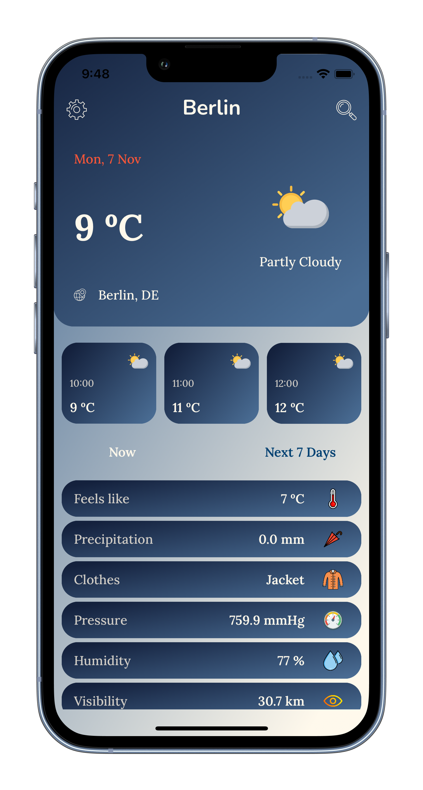
  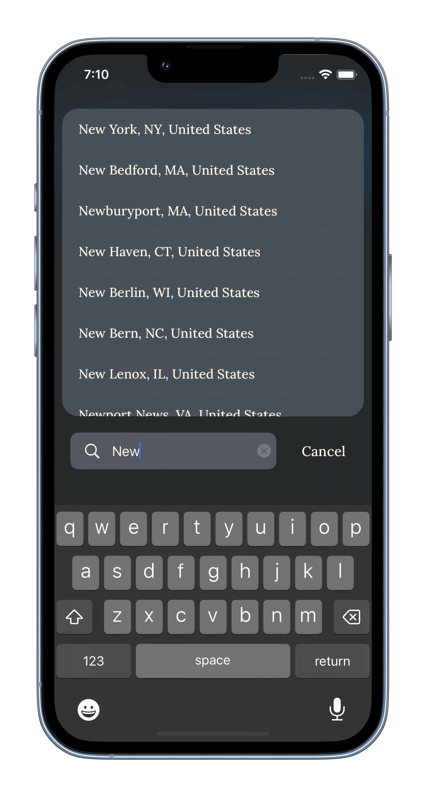

  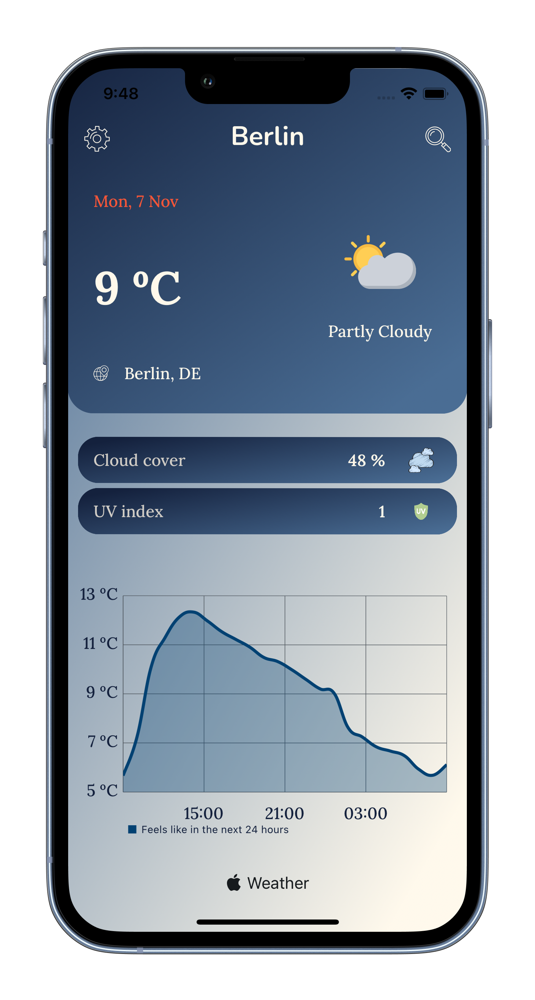
  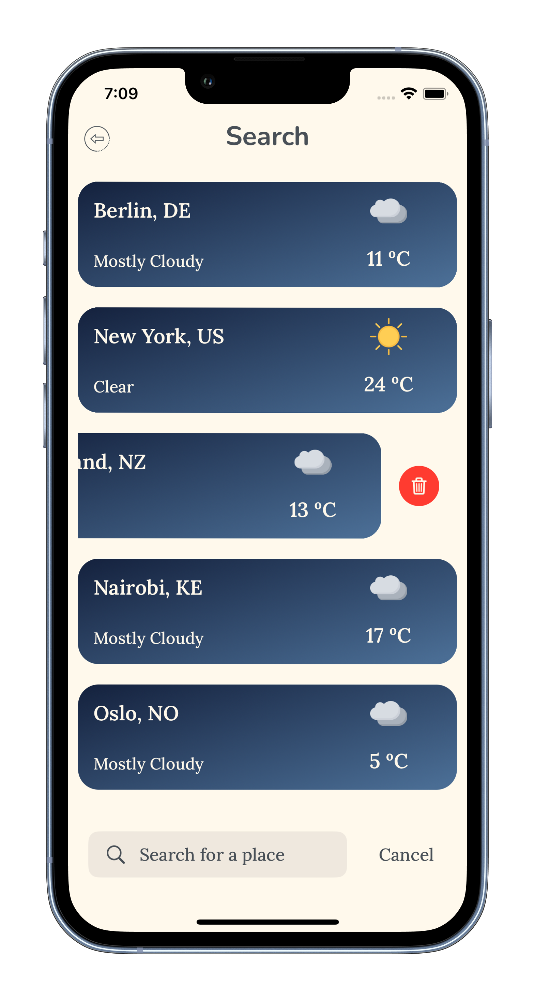

  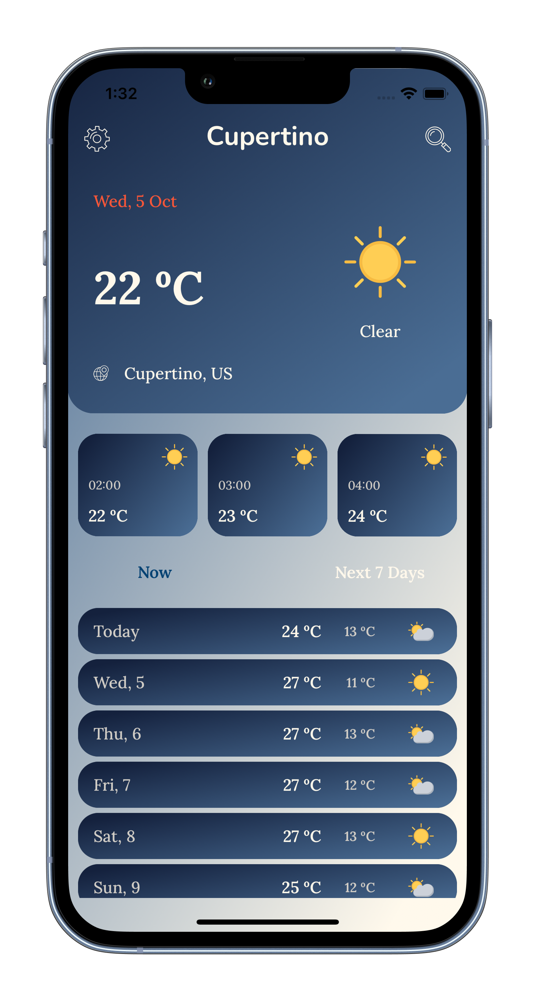
  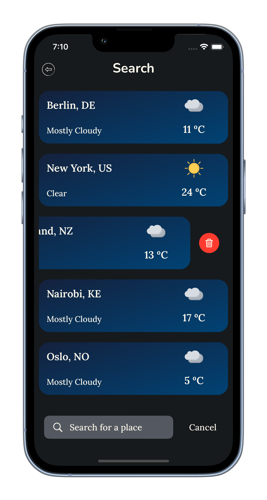

### Hourly Forecast Screen

  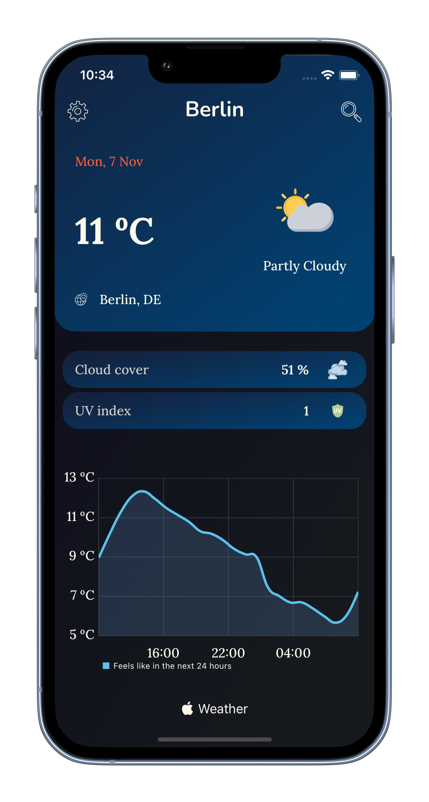
  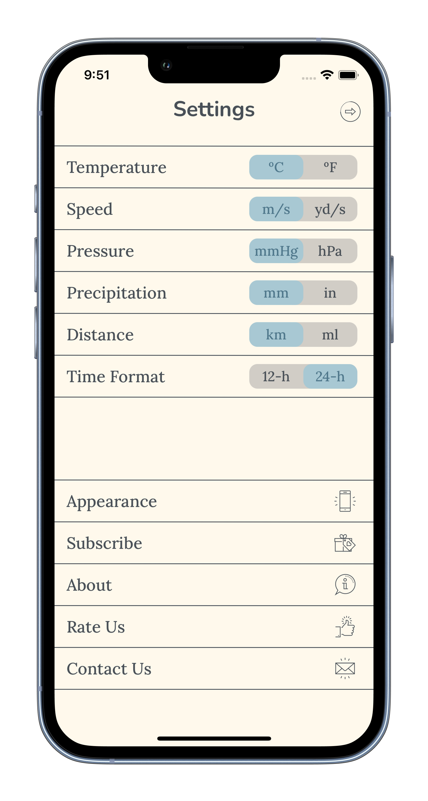

### Search Screen

  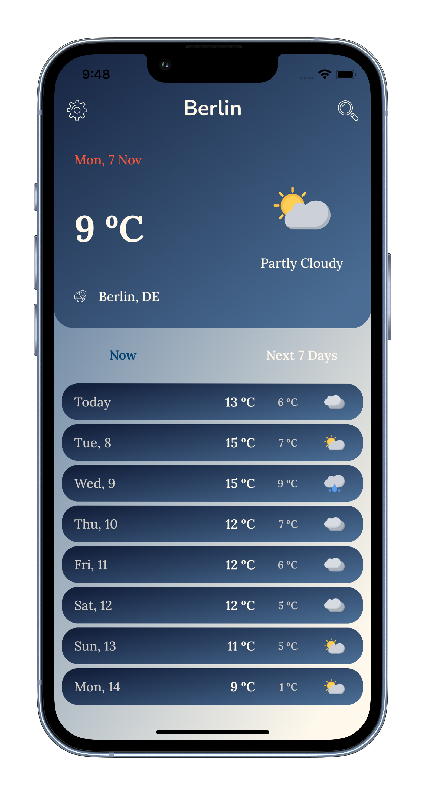
  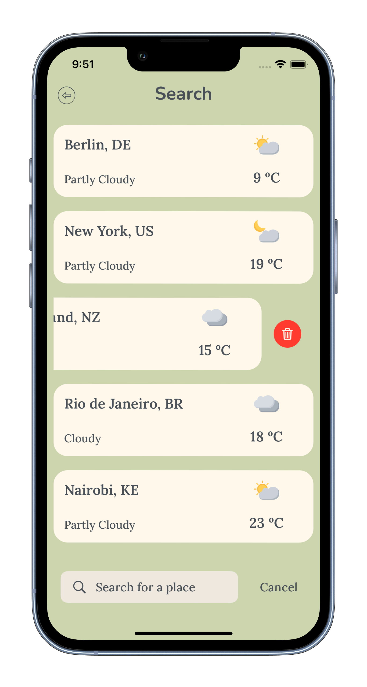

  

### Settings Screens

  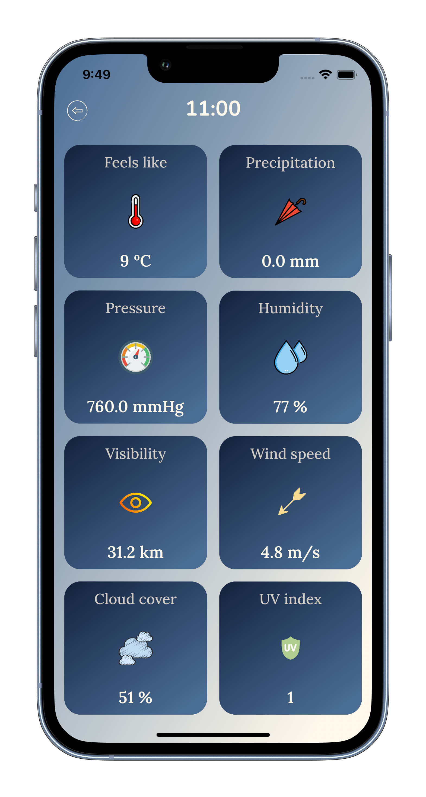
  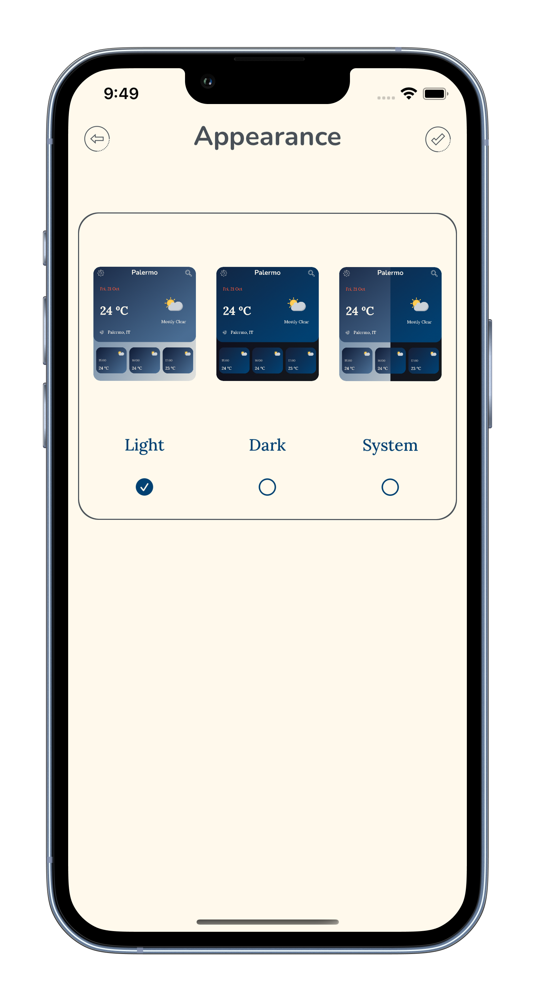
  

