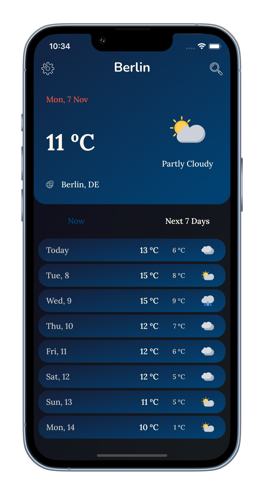

# Sunny
Sunny - my final project in the iOS Development course in TeachMeSkills school. 
This is a weather app which is currently WIP.

## API
- WeatherKit REST API
- Apple Maps Server API

## External Libraries
- Alamofire
- SwipeCellKit
- SPIndicator
- Charts

## Compatibility
- iPhone 
Requires iOS 14.0 or later 

## Preview
### Onboarding Screen

### Hourly Forecast Screen

### Search Screen

### Settings Screen

### Appearance Screen

